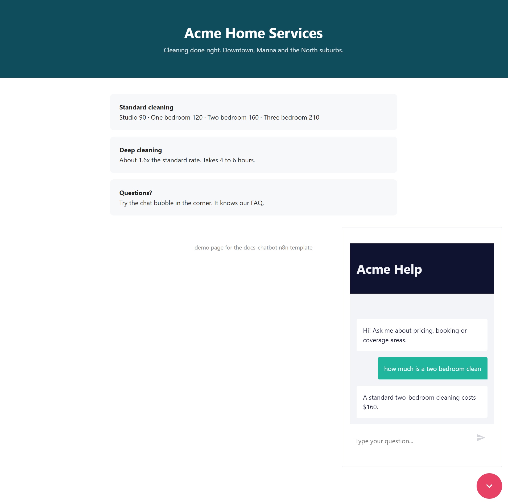
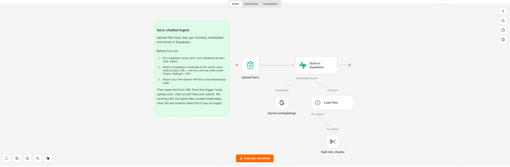
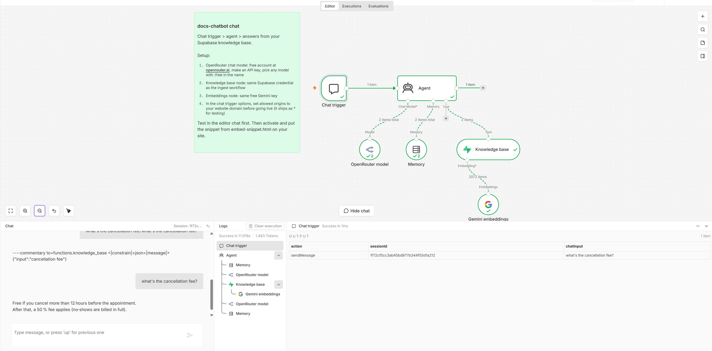

# docs-chatbot

A chat widget for your website that answers questions from your own documents. Upload your FAQs or docs once, drop one snippet on your site, done. The whole stack runs on free tiers.



That's a plain html page talking to this workflow. The price it quotes comes from the sample FAQ, not the model's imagination.

This is RAG (retrieval augmented generation) if you want the buzzword: your files get chunked and embedded into a Supabase vector table, and when a visitor asks something, the bot searches those chunks and answers from them instead of inventing things. If the answer isn't in your docs it says so.

Two workflows:

1. ingest-workflow.json gives you an upload form. Files in, vectors out.



2. chat-workflow.json is the bot itself. Chat trigger, agent, knowledge base search, memory. Here it is answering from the sample FAQ, with the knowledge base search visible in the logs:



## The stack, all free

- n8n, self-hosted or cloud
- Supabase free tier for the vector database
- OpenRouter free models for the chat LLM (they have several with tool calling)
- Google Gemini API free tier for embeddings

No card needed anywhere.

## Setup Time

Maybe 20 minutes.

### 1. Supabase

Make a free project at supabase.com. Open the SQL editor, paste in [supabase-setup.sql](supabase-setup.sql), run it. That creates the pgvector extension, a documents table and the match function n8n looks for.

Grab two things from Project Settings > API: the project URL and the service_role key.

### 2. Import both workflows

n8n > Workflows > Import from file, once per json.

### 3. Credentials

- Supabase: new Supabase API credential in n8n with the URL and service_role key. Both vector store nodes use it
- Gemini: free key from aistudio.google.com, saved as Google Gemini(PaLM) API. Both embeddings nodes use it. If you already set up my [ai-bill-extractor](../ai-bill-extractor/), it's the same credential
- OpenRouter: free account at openrouter.ai, create an API key, new OpenRouter credential in n8n

### 4. Feed it documents

Open the ingest workflow, click the form trigger, open the form URL. Upload your files (.md, .txt, .pdf) and submit. Check the executions tab, green means your docs are in Supabase now. There's a [sample-docs/faq.md](sample-docs/faq.md) with fake company FAQs if you just want to test.

### 5. Talk to it

Open the chat workflow and use the chat panel in the editor. Ask something your docs answer, then ask something they don't. It should nail the first and admit the second. If it hallucinates, tighten the system message in the Agent node.

### 6. Put it on your site

This is the part everyone asks about, so step by step.

First, activate the workflow. Top right of the chat workflow there's a Publish button (or an Active toggle depending on your n8n version). Click it. Until you do this, the bot only works inside the editor.

Second, find your chat URL. Double click the **Chat trigger** node. Because it's set to public, the panel shows a field called **Chat URL**. It looks like this:

```
https://your-n8n-server.com/webhook/abc123-def456/chat
```

The abc123-def456 part is unique to your workflow. Copy the whole thing. Careful: there are two tabs, Test and Production. You want the **production** one, the test URL only works while the editor is open.

Third, paste it into the snippet. Open [embed-snippet.html](embed-snippet.html), find this line:

```js
webhookUrl: 'YOUR_CHAT_TRIGGER_WEBHOOK_URL',
```

and replace YOUR_CHAT_TRIGGER_WEBHOOK_URL with the URL you copied, keeping the quotes:

```js
webhookUrl: 'https://your-n8n-server.com/webhook/abc123-def456/chat',
```

Fourth, put the snippet on your site. Open your website's HTML and paste the whole snippet (the `<link>` and `<script>` block) just before the closing `</body>` tag, at the bottom of the page. If you use WordPress, a "custom HTML" footer widget or a header/footer plugin does the same job. Wix/Squarespace have an "embed code" or "custom code" setting under site settings.

That's it. Reload your site and there's a chat bubble in the bottom right corner, talking to your bot. No backend code on the website side, the snippet just points the widget at your n8n URL.

Don't have a website yet and just want to see it work? Paste the snippet into a text file, save it as test.html, double click it. The bubble works from a local file too.

Before going live for real, change **allowed origins** in the chat trigger options from * to your actual domain (like https://yoursite.com). Otherwise anyone can embed your bot on their site and burn through your quota.

Building your own chat UI instead of using the widget? The trigger is just a webhook, see the comment at the bottom of the embed snippet.

## Things that will bite you

- The embedding model at ingest and at chat MUST match. Both workflows ship with gemini-embedding-001. Change one, change both, and re-ingest
- The SQL sets vectors to 3072 dimensions for that model. A different embedding model means a different dimension, edit the sql and rebuild the table
- Free OpenRouter models get rate limited at busy hours and answers take 10-30s (the agent makes two model calls and free tiers queue). Swap between :free models freely, or drop $10 on OpenRouter once for priority and a 1000/day cap
- Skip gemma models for the chat (no tool calling, the search tool never fires) and skip reasoning/R1 models (slow)
- Re-uploading the same file duplicates its chunks. Run `truncate table documents;` in Supabase first if you're re-ingesting
- Memory is in-memory buffer by default, conversations reset when n8n restarts. Swap the Memory node for Postgres Chat Memory pointed at your Supabase db if that matters to you

## License

[MIT](../../LICENSE)
